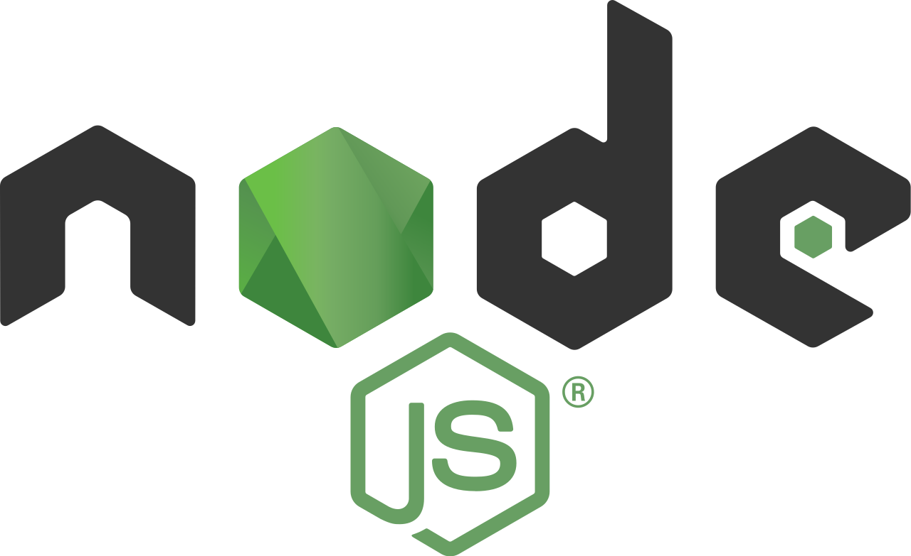

<h1>Becoming a Node.js developer 🐢🚀</h1>

This document's purpose is to share my **personal** experience and resources to those who would like to
become a [Node.js](https://nodejs.org/fr/) back-end developer 😎.

My experience and opinions will strongly influence this paper 👿 (so I invite you to keep a strong critical mind towards me to build your own path 🐤).

This document is not set in stone and will evolve as much as I deem necessary over time.

# Summary

- [👋 Introduction](./chapters/1-introduction/1-introduction.md)
    - [👀 Who am I?](./chapters/1-introduction/1-introduction.md#-Who-am-I-)
    - [👊 For whom?](./chapters/1-introduction/1-introduction.md#-For-whom-)
    - [💬 Why?](./chapters/1-introduction/1-introduction.md#-Why-)
    - [📌 Legends](./chapters/1-introduction/1-introduction.md#📌-legends)
- [JavaScript](./chapters/2-javascript/1-introduction.md)
  - [📕 Dedicate a daily time to reading](./chapters/2-javascript/2-reading.md)
    - [📖📐 Practice with a book](./chapters/2-javascript/2-reading.md#📖📐-practice-with-a-book)
  - [💪 Challenge yourself regularly](./chapters/2-javascript/3-challenge.md)
    - [🏫 Nodeschool](./chapters/2-javascript/3-challenge.md#🏫-nodeschool)
    - [🔎 The other websites](./chapters/2-javascript/3-challenge.md#🔎-the-other-websites)
    - [🏆 Competitive programming](./chapters/2-javascript/3-challenge.md#🏆-competitive-programming)
  - [🌌 Online courses, talks and articles](./chapters/2-javascript/4-online-courses-talks-articles.md)
    - [Udemy vs Frontend Masters](./chapters/2-javascript/4-online-courses-talks-articles.md#udemy-vs-frontend-masters)
    - [📄 Articles](./chapters/2-javascript/4-online-courses-talks-articles.md#📄-articles)
      - [Axel Rauschmayer](./chapters/2-javascript/4-online-courses-talks-articles.md#uaxel-rauschmayeru)
      - [Jake Archibald](./chapters/2-javascript/4-online-courses-talks-articles.md#ujake-archibaldu)
      - [Others](./chapters/2-javascript/4-online-courses-talks-articles.md#uother-articlesu)
    - [📺 Talks](./chapters/2-javascript/4-online-courses-talks-articles.md#📺-talks)
  - [🔧 Engine & VM JavaScript (V8 etc)](./chapters/2-javascript/5-VM.md)
    - [😡 The dangerous hype of benchmarks](./chapters/2-javascript/5-VM.md#😡-the-dangerous-hype-of-benchmarks)
- **⚡ ECMAScript**
  - [JavaScript or ECMAScript ?](./chapters/3-ecmascript/1-javascript-or-ecmascript.md)
  - [ECMAScript 6 (ES2015)](./chapters/3-ecmascript/2-ecmascript-6.md)
  - [JavaScript: 20 years](./chapters/3-ecmascript/3-javascript-20years.md)
  - [TC39](./chapters/3-ecmascript/4-tc39.md)
- [TypeScript](./chapters/4-typescript/1-introduction.md)
  - [🙊 TypeScript is secondary](./chapters/4-typescript/2-typescript-is-secondary.md)
  - [🐲 Resources on writing type annotations](./chapters/4-typescript/3-resources.md)
- [🐢 Node.js](./chapters/5-nodejs/1-introduction.md)
  - [🐥 Resources for beginners](./chapters/5-nodejs/2-beginners-resources.md)
  - [🌐 Discovery of the HTTP Node.js ecosystem](./chapters/5-nodejs/3-node-http-ecosystem.md#🚣-introduction)
    - [💡 Native HTTP server with Node.js and some links on the protocol.](./chapters/5-nodejs/3-node-http-ecosystem.md#💡-native-http-server-with-nodejs-and-some-links-on-the-protocol)
    - [🚁 Framework Small scope](./chapters/5-nodejs/3-node-http-ecosystem.md#🚁-framework-small-scope)
    - [✈️ Framework Big scope](./chapters/5-nodejs/3-node-http-ecosystem.md#✈️-framework-big-scope)
    - [🌠 Framework Full-stack](./chapters/5-nodejs/3-node-http-ecosystem.md#🌠-framework-full-stack)
    - [🎯 How to choose](./chapters/5-nodejs/3-node-http-ecosystem.md#🎯-how-to-choose)
  - [📰 Conferences and Articles](./chapters/5-nodejs/4-conf-and-articles.md)
  - [🎡 Event-loop](./chapters/5-nodejs/5-event-loop.md#introduction)
    - [Reactor pattern](./chapters/5-nodejs/5-event-loop.md#reactor-pattern)
    - [🎥 A bit of history](./chapters/5-nodejs/5-event-loop.md#🎥-a-bit-of-history)
    - [Libuv](./chapters/5-nodejs/5-event-loop.md#libuv)
    - [📜 Articles et talks](./chapters/5-nodejs/5-event-loop.md#📜-articles-et-talks)
  - [👽 Native API (native addon creation in C and C++)](./chapters/5-nodejs/6-native-api.md)
  - [📟 CLI](./chapters/5-nodejs/7-cli.md)
  - [📦 Packages](./chapters/5-nodejs/8-packages.md)
  - [🔍 Debugging & Profiling](./chapters/5-nodejs/9-debugging-and-profiling.md)
  - [Modules (CJS & ESM)](./chapters/5-nodejs/10-modules.md)
  - [WebSocket](./chapters/5-nodejs/11-websocket.md)
  - [📊 Unit testing and coverage](./chapters/5-nodejs/12-unit-testing-and-coverage.md)
    - [💃 Méthodologies](./chapters/5-nodejs/12-unit-testing-and-coverage.md#💃-méthodologies)
  - **🌟 The different core modules**
    - [Console](chapters/5-nodejs/13-core-modules/1-console.md)
    - [Events](chapters/5-nodejs/13-core-modules/2-events.md)
    - [Path](chapters/5-nodejs/13-core-modules/3-path.md)
    - [FileSystem (fs)](chapters/5-nodejs/13-core-modules/4-fs.md)
    - [Timers](chapters/5-nodejs/13-core-modules/5-timers.md)
    - [URL (API WHATWG)](chapters/5-nodejs/13-core-modules/6-url.md)
    - [OS](chapters/5-nodejs/13-core-modules/7-os.md)
    - [Child Process](chapters/5-nodejs/13-core-modules/8-child_process.md)
    - [Utilities](chapters/5-nodejs/13-core-modules/9-utilities.md)
    - [VM](chapters/5-nodejs/13-core-modules/10-vm.md)
    - [Assert](chapters/5-nodejs/13-core-modules/11-assert.md)
    - [Zlib](chapters/5-nodejs/13-core-modules/12-zlib.md)
    - [Readline](chapters/5-nodejs/13-core-modules/13-readline.md)
    - [perf_hooks](chapters/5-nodejs/13-core-modules/14-perf_hooks.md)
    - [async_hooks](chapters/5-nodejs/13-core-modules/15-async_hooks.md)
    - [Crypto](chapters/5-nodejs/13-core-modules/16-crypto.md)
  - [NPM](chapters/5-nodejs/14-npm-package-archive.md)
  - **💾 Database**
    - [Introduction](chapters/6-database/1-introduction.md)
    - [Influence of Node.js on the chapter](chapters/6-database/2-influence-node.md)
    - [The importance of learning SQL](chapters/6-database/3-learning-sql.md)
    - [PostgreSQL](chapters/6-database/4-postgres.md)
    - [MySQL & MariaDB](chapters/6-database/5-mysql-mariadb.md)
    - [MongoDB](chapters/6-database/6-mongodb.md)
    - [Redis](chapters/6-database/7-redis.md)
    - [SQLite](chapters/6-database/8-sqlite.md)
    - [Others DB](chapters/6-database/9-other-db.md)
    - [ORM or not ?](chapters/6-database/10-orm.md)
  - **📡 MQTT (broker)**
    - [Introduction](chapters/7-mqtt/1-introduction.md)
    - [Redis](chapters/7-mqtt/2-redis.md)
    - [RabbitMQ, ZeroMQ](chapters/7-mqtt/3-rabbitMQ-zeroMQ.md)
    - [Autres](chapters/7-mqtt/4-others.md)
  - **🔐 Security**
    - [Introduction](chapters/8-security/1-introduction.md)
    - [Audit](chapters/8-security/2-audit.md)
    - [Keep your environment under control](chapters/8-security/3-environment.md)
    - [Direct and indirect dependencies](chapters/8-security/4-dependencies.md)
    - [Supply Chain Attack](chapters/8-security/4-dependencies.md#supply-chain-attack)
    - [Common Security Breach](chapters/8-security/5-common-breach.md)
    - [Static Analysis & AST](chapters/8-security/6-ast.md)
    - [Additional links and resources to read](chapters/8-security/7-link-resources.md)
    - [If security is an area that interests you](chapters/8-security/8-interested.md)
  - [GIT](chapters/9-git/1-git.md)
  - **🌇 Architecture & Paradigms**
    - [SemVer](chapters/10-architecture/1-semver.md)
    - [CalVer](chapters/10-architecture/2-calver.md)
    - [JSON Schema](chapters/10-architecture/3-json-schema.md)
    - [Documentation](chapters/10-architecture/4-documentation.md)
    - [Clean code](chapters/10-architecture/5-clean-code.md)
    - [Object Oriented Programming](chapters/10-architecture/6-object-oriented-programming.md)
    - [Design patterns](chapters/10-architecture/7-design-pattern.md)
    - [Compiler & Interpreter](chapters/10-architecture/8-compiler-interpreter.md)
    - [DDD (Domain Driven Design)](chapters/10-architecture/9-domain-driven-design.md)
    - [Others](chapters/10-architecture/10-others.md)
  - **🔬 Monitoring**
    - [Introduction](chapters/11-monitoring/1-introduction.md)
    - [API](chapters/11-monitoring/1-introduction.md#api)
  - **💻 System**
    - [Introduction](chapters/12-system/1-introduction.md)
    - [Scripting: Shell, Bash & Powershell](chapters/12-system/2-scripting.md)
  - [Thanks](chapters/13-thanks/1-thanks.md)