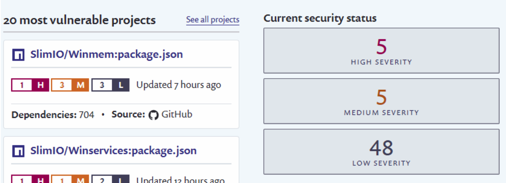

# 🔐 Security

## Audit

It becomes mandatory to set up automatic security audits on your dependencies in order to have even a minimal view of "known" vulnerabilities within each project. Of course, this is only the first step towards optimal security!

Tools such as [Snyk](https://snyk.io/), [sqreen](https://www.sqreen.com/), [npm audit](https://docs.npmjs.com/auditing-package-dependencies-for-security-vulnerabilities) allow you to have an overview of active CVEs or possible attacks on your projects (snyk's free offer is rather generous).

*Example below of a snyk dashboard on the SlimIO project*

The vulnerabilities detected during the **runtime phase obviously have priority** (**<u>since they concern the codes executed in production</u>**).

> ⚠️ This does not mean that the vulnerabilities detected on development dependencies are not important!

You can open one of the projects to have more information on the various current issues. The interface will give you a whole set of information such as references and explanations of the problem. And, if necessary, corrective measures to solve the problem.

---

⬅️ [🔐 Security: Introduction](./1-introduction.md) |
➡️ [🔐 Security: Keep your environment under control](./3-environment.md)