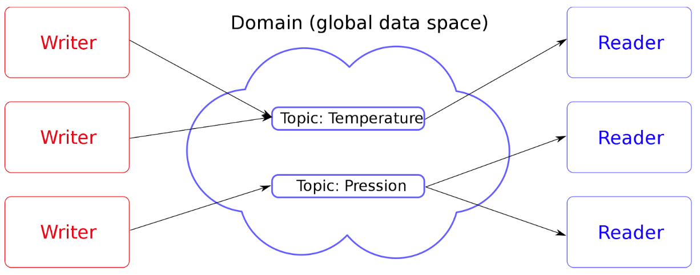

# 📡 MQTT (broker)

## Introduction 

MQTT (Message Queuing Telemetry Transport) is a [publish-subscribe](https://fr.wikipedia.org/wiki/Publish-subscribe) messaging protocol based on the TCP/IP protocol ([Wikipedia](https://fr.wikipedia.org/wiki/MQTT)).

MQTT is rather popular for the creation of components (software) that we will call [message brokers](https://en.wikipedia.org/wiki/Message_broker) (like a Queue where several actors can write and consume messages). The idea is often to avoid too strong a culprit between different components of an architecture.

Note that we are often talking here about the MQTT protocol but there are many solutions which are much lower level and which will prefer to keep their own TCP/IP implementations to maximize performance.

---

⬅️ [💾 Database: ORM or not ?](../database/orm.md) |
➡️ [📡 MQTT (broker): Redis](./redis.md)