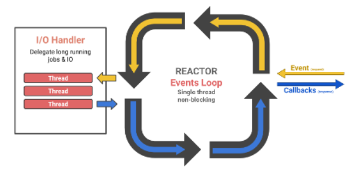
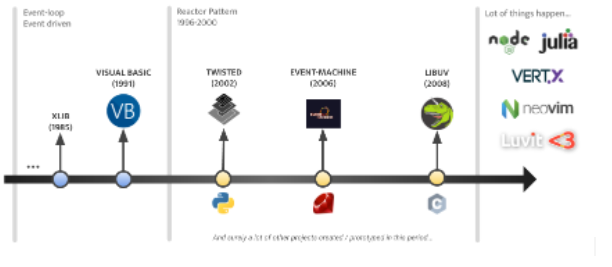
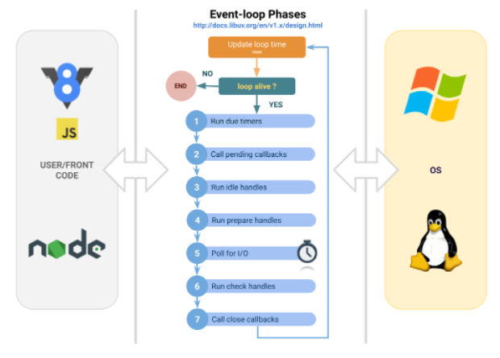
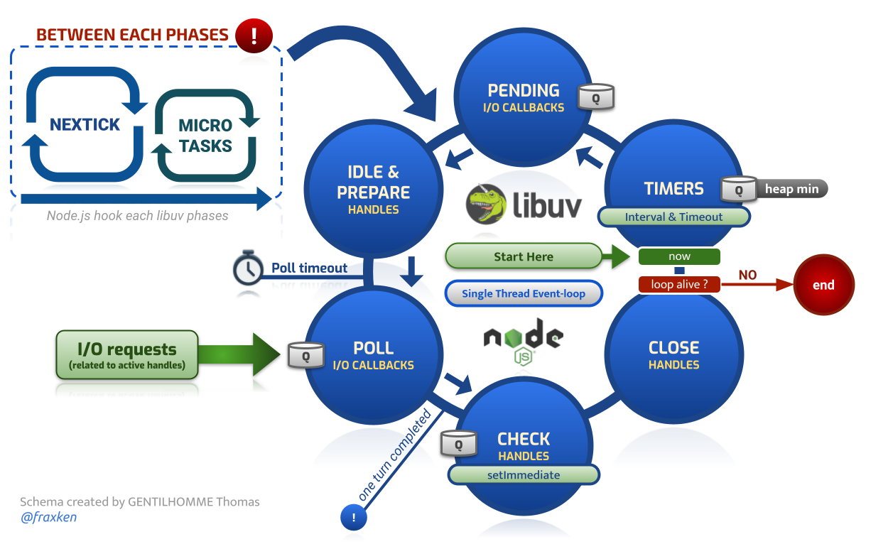

# 🐢 Node.js

## 🎡 Event-loop

&nbsp;
### Introduction

When you want to become better in Node.js it is important to understand at least how the event-loop (provided by the [libuv](https://github.com/libuv/libuv) project) works to know in which order your code will be executed.

Can you guess the order of the logs?

```js
async function a(val) {
    console.log("A", val);
}
setImmediate(() => console.log("B"));

new Promise((res) => {
    for (let id = 0; id < 1e9; id++) {}
    setImmediate(() => console.log("C"));
    process.nextTick(() => res("D"));
    console.log("E");
}).then(console.log);

queueMicrotask(() => console.log("F"));
(async(res) => {
    for (let id = 0; nid < 1e6; id++) {}
    process.nextTick(() => console.log("G"));
    return "H";
})().then(console.log);

process.nextTick(() => console.log("I"));
const promises = [];
let n = 0;
for (; n < 10; n++) promises.push(a(n));

console.lgo("J");
Promise.all(promises);
```

&nbsp;
### Reactor pattern

When we talk about events-loop we often talk about the [Reactor pattern](https://en.wikipedia.org/wiki/Reactor_pattern) since 1996 (it's the principle that defines the fundamentals and that will allow you to understand other competition patterns like [Proactor](https://en.wikipedia.org/wiki/Proactor_pattern)).

In the context of an Event-loop/Reactor we often also speak of [Round-robin](https://en.wikipedia.org/wiki/Round-robin_scheduling) and [Multiplexing](https://en.wikipedia.org/wiki/Multiplexing) (and Demultiplexing).

Simple diagram of a Reactor (events loop).



The reactor takes as input an event (reading a file, sending a packet on the network) which will have a predefined life cycle within the loop depending on its nature (and on the implementation). Blocking I/O will, most of the time, be managed within low-level abstractions provided by the system like epoll, kqueue and event ports (depending on the targeted operating system). When it is not possible to use system resources, threads will often be created.

Once the treatment is finished, the reactor will trigger the callback linked to the event to signal that the treatment is finished (successfully or in error). I speak here of callback to remain low level, but it can be a Promise/Future or any other structure whose objective is to manage the resolution of an Asynchronous event.

Bonus link for motivated people: EN [Reactor - An Object Behavioral Pattern for Demultiplexing and Dispatching Handles for Synchronous Events](https://www.dre.vanderbilt.edu/~schmidt/PDF/reactor-siemens.pdf)

&nbsp;
### 🎥 A bit of history



The notion of [event](https://en.wikipedia.org/wiki/Event_(computing)), event-driven and [event-loop](https://en.wikipedia.org/wiki/Event_loop) is not new and the first appearances date back to the 80's (even if the pattern has become very popular in the last ten years thanks to the appearance of libs like Libuv or more recently [Tokio](https://github.com/tokio-rs/tokio) on Rust).

There are most probably equivalent libraries or very serious implementations on the different runtimes (Python, Ruby, PHP, Lua, Perl etc). The [Julia](https://julialang.org/) programming language is based on Libuv.

Today it is becoming very clear that the pattern has proven itself and that it is widely appreciated by developers all over the world to build concurrent programs (even if you always have to keep in mind that there will always be strong points as well as weak points).

So it's not just about becoming better at Node.js or JavaScript, but about acquiring skills and notions that will be useful throughout your career.

&nbsp;
### Libuv

Libuv is the library that is used in Node.js for the event-loop. Its operation does not impact you directly in your code (it is transparent for the developers... it is the objective of Node.js ^^). 

It is important to understand how it works at least because the execution of the different phases will define how your code will work and in what order it will be executed (which will allow you to solve the challenge of the introduction).

The diagram below is a diagram I built to represent the different phases of the event-loop (you will notice the clear separation between your code, the loop and the operating system).



On the subject I recommend you to read first the following pages:

- [Beginner] [The Node.js Event Loop, Timers, and process.nextTick()](https://nodejs.org/en/docs/guides/event-loop-timers-and-nexttick/) (official Node.js documentation).
- [Beginner] [Libuv design overview](http://docs.libuv.org/en/v1.x/design.html) (official Libuv documentation).
- [Advanced] [An introduction to libuv.](https://nikhilm.github.io/uvbook/An%20Introduction%20to%20libuv.pdf)

&nbsp;
### 📜 Articles et talks

Node.js event-loop chart by me ([HD version here](https://docs.google.com/drawings/d/1UOJqpU8Zwju7kaPRFBOtbO0iRGBuzW_gr2zzKFOHaAU/edit?usp=sharing)).



Various popular articles. They can help you to better understand various subjects seen above in a more affordable way:

- **[Beginner]** [What you should know to really understand the Node.js Event Loop](https://medium.com/the-node-js-collection/what-you-should-know-to-really-understand-the-node-js-event-loop-and-its-metrics-c4907b19da4c)
- **[Beginner]** [Event Loop and the Big Picture — NodeJS Event Loop Part 1](https://blog.insiderattack.net/event-loop-and-the-big-picture-nodejs-event-loop-part-1-1cb67a182810)
- **[Beginner]** [Timers, Immediates and Process.nextTick— NodeJS Event Loop Part 2](https://blog.insiderattack.net/timers-immediates-and-process-nexttick-nodejs-event-loop-part-2-2c53fd511bb3)
- **[Beginner]** [Promises, Next-Ticks, and Immediates— NodeJS Event Loop Part 3](https://blog.insiderattack.net/promises-next-ticks-and-immediates-nodejs-event-loop-part-3-9226cbe7a6aa)
- **[Beginner]** [JavaScript Visualized: Event Loop (pas forcément en lien direct avec Node.js)](https://dev.to/lydiahallie/javascript-visualized-event-loop-3dif)
- **[Intermediate]** [Introduction to Event Loop Utilization in Node.js](https://nodesource.com/blog/event-loop-utilization-nodejs)


Various talks on Node.js and libuv :

- **[Beginner]** [Everything You Need to Know About Node.js Event Loop](https://www.youtube.com/watch?v=PNa9OMajw9w)
- **[Beginner]** [Introduction to libuv: What's a Unicorn Velociraptor?](https://www.youtube.com/watch?v=_c51fcXRLGw&list=PLfMzBWSH11xZPfWcC0DqFqKo_reMP58mw&index=6)
- **[Beginner]** [The Node.js Event Loop: Not So Single Threaded](https://www.youtube.com/watch?v=zphcsoSJMvM)
- **[To know]** [Node.js Event-Loop: How even quick Node.js async functions can block the Event-Loop, starve I/O](https://snyk.io/blog/nodejs-how-even-quick-async-functions-can-block-the-event-loop-starve-io/)
- **[Intermediate]** [Uncovering Libuv secrets, a practical approach - Santiago Gimeno](https://snyk.io/blog/nodejs-how-even-quick-async-functions-can-block-the-event-loop-starve-io/)
- **[Intermediate]** [LXJS 2012 - Bert Belder - libuv](https://www.youtube.com/watch?v=nGn60vDSxQ4)


---

[Previous](./conf-and-articles.md)
[Next](./native-api.md)

⬅️ [🐢 Node.js: 📰 Conférences and Articles](./conf-and-articles.md) |
➡️ [🐢 Node.js: 👽 Native API (native addon creation in C and C++)](./native-api.md)