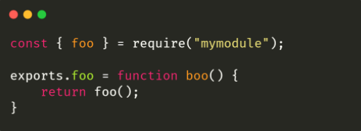
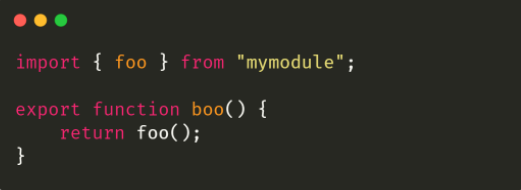

# 🐢 Node.js

## Modules (CJS & ESM)

In Node.js there are two ways to manage modules:

- [CJS](https://nodejs.org/api/modules.html) for Common JavaScript
- [ESM](https://nodejs.org/api/esm.html) for ECMAScript modules

ESM is the new standard integrated since ECMAScript 6 for module management. However, historically Node.js has been using CJS since the beginning and at the time there were a lot of concerns about the ESM specification (which made the implementation in the Node js ecosystem complex).

With CJS it is necessary to use the require() function and keywords like module.exports while in ESM you can use the import and export keywords.

ESM support on Node.js is becoming more and more stable and it is therefore not surprising that it will become the default module system in the near future.

I recommend you to listen to the following talks to better understand the subject:

- [Extra Special Modules - Myles Borins, Google](https://www.youtube.com/watch?v=bP0tlIcA3ns)
- [Keynote: The Future of JavaScript is Universal - Myles Borins, Developer Advocate, Google](https://www.youtube.com/watch?v=o2M7g8Xwc7g)
- [ES Modules in Node.js - Gil Tayar](https://www.youtube.com/watch?v=mMEKrHmZLpQ&list=PL0CdgOSSGlBalMPxFFycq7OIqQF8cJS28&index=7)

Articles related to ESM

- [Get Ready For ESM - Sindresorhus](https://blog.sindresorhus.com/get-ready-for-esm-aa53530b3f77)
- [Pure ESM package - Sindresorhus](https://gist.github.com/sindresorhus/a39789f98801d908bbc7ff3ecc99d99c)
- [Using ES Modules (ESM) in Node.js: A Practical Guide (Part 1](https://gils-blog.tayar.org/posts/using-jsm-esm-in-nodejs-a-practical-guide-part-1/)

---

[Previous](./debugging-and-profiling.md)
[Next](./websocket.md)