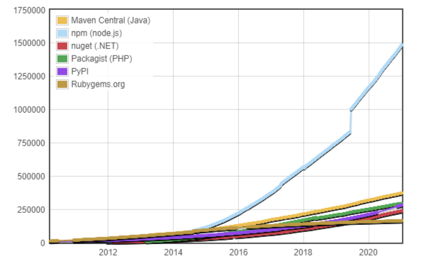

# 🐢 Node.js

## 📦 Packages

The use and creation of packages in the JavaScript ecosystem is a real strength and a source of incredible opportunities.

(module count by ecosystem)

Unfortunately many fail to see the emergence of a pattern that is to be able to segment projects very simply into different modules that will be much easier to maintain and test in the long term. Most developers don't realize the power of the module system they have in their hands (and it's not only about open-source or npm).

This is one of the remarks I make most to my clients as a Node.js Expert... Everyone has a tendency to build by instinct non-modular monoliths while for example the algorithms related to the business can be managed within a separate module (this kind of details can accelerate the productivity of a team by a ratio of 5... **it's an experience**).

And there is no question here of necessarily segmenting into 50 modules... 2 to 4 modules is already a good start for a team.

If you have the opportunity or an idea of packages then I strongly recommend you to try the adventure at least once.

&nbsp;
### Articles and talks

- EN [Getting started NPM](https://docs.npmjs.com/getting-started)
- EN [NodeSchool - How to NPM](https://github.com/workshopper/how-to-npm)
- EN [The package.json guide](https://nodejs.dev/learn/the-package-json-guide)
- EN [CJ Silverio, CTO of npm](https://www.youtube.com/watch?v=HH3aNjjhMg8)
- EN [npm and the Future of JavaScript - Laurie Voss, npm, Inc.](https://www.youtube.com/watch?v=0PU-4GGLzGg)
- EN [Radical Modularity - Aria Stewart, npm, Inc.](https://www.youtube.com/watch?v=SsIdWFtp2QA)
- EN [Awesome npm](https://github.com/sindresorhus/awesome-npm)

It is possible to use the [npm link](https://docs.npmjs.com/cli/v6/commands/npm-link) command to work with packages or modules that are not yet published in the npm registry.

&nbsp;
### Workshops
You're a beginner and you want to train ? Discover this simple workshop: EN [How to npm](https://github.com/workshopper/how-to-npm)

&nbsp;
### Monorepo & workspaces

It can also be interesting to explore the monorepos and workspaces which are now included by default on yarn and npm 7. It is also possible to use the learn package.

It's a very interesting solution, especially to have only one git repo but still keeping the advantage of the segmentation in modules/packages. Some links to read more about this subject:

- EN [Simplify your monorepo with npm 7 workspaces](https://dev.to/limal/simplify-your-monorepo-with-npm-7-workspaces-5gmj)
- EN [npm Workspaces (RFC)](https://github.com/npm/rfcs/blob/latest/implemented/0026-workspaces.md)
- EN [Workspaces in Yarn](https://classic.yarnpkg.com/blog/2017/08/02/introducing-workspaces/)
- EN [pnpm Workspace](https://pnpm.js.org/en/workspaces)
- EN [🐉 A tool for managing JavaScript projects with multiple packages.](https://github.com/lerna/lerna)

I am just starting to use them for different projects, so I will complete the section in the next few months.

&nbsp;
### 🔍 Debugging & Profiling

Improving on topics like debugging is very important as a developer in order not to be lost on what to do when you encounter a hairy problem (which will require a little more than some console.log). 

> Note however that if you need to go that far, there may be a problem in the way you architect your code.

Here is a list of resources that you may need to read:

- EN [Node.js debugging best practices - Joyent](https://www.joyent.com/node-js/production/debug)
- EN [Node.js official debugging guide](https://nodejs.org/en/docs/guides/debugging-getting-started/)
- EN [Node.js debugger API](https://nodejs.org/api/debugger.html)
- EN [VS Code integrated tools for Node.js](https://code.visualstudio.com/docs/nodejs/nodejs-tutorial#_debugging-your-node-application)
- EN [Easy profiling for Node.js Applications](https://nodejs.org/en/docs/guides/simple-profiling/)
- EN [Create a Dump of the V8 Heap in Nodejs](https://medium.com/better-programming/make-a-dump-of-the-v8-heap-and-inspect-for-your-node-app-b69f7b68c162)
- EN [Node.js console API](https://nodejs.org/api/console.html) (car il n’y a pas que console.log ^^).
- EN [Clinic.js rises to the top in diagnosing Node.js performance issues](https://www.nearform.com/blog/clinicjs-rises-top-diagnosing-nodejs-performance/)
- EN [Experimenting with remote debugging: Node.js runtime code injection](https://blog.sqreen.com/remote-debugging-nodejs-runtime-code-injection/)

If you are rather looking for tools (for flamegraphs generation for example).

- EN [0x🔥](https://github.com/davidmarkclements/0x)
- EN [Clinicjs Flame](https://clinicjs.org/flame/) (the tool has many other modes that I also recommend).
- EN [Investigates v8/Node.js function deoptimizations.](https://github.com/thlorenz/deoptigate)
- EN [Collect runtime type information 😻 of your JavaScript code.](https://github.com/fhinkel/type-profile)
- EN [Why is node running](https://github.com/mafintosh/why-is-node-running) (cool to find alive event loop references).

If you need to benchmark your tests then I recommend [autocannon.](https://github.com/mcollina/autocannon)

---

[Previous](./cli.md)
[Next](./packages.md)