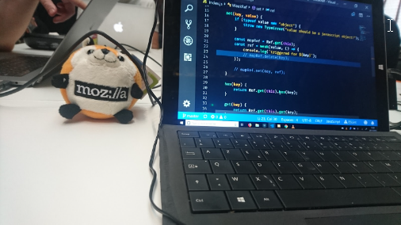

# JavaScript

## 💪 Mettez-vous au défi régulièrement

S'entraîner par le biais de différents exercices et challenges est important car cela va vous permettre d’améliorer plusieurs branches de votre spectre de compétences:

- Algorithmie (**ne pas non plus s’attendre à une progression incroyable** 😟).
- Améliorer votre vitesse d’exécution (fluidité pour écrire le code).
- Pratiquer (et *potentiellement* découvrir) des fonctionnalités du langage. À noter que dans ce cas-là il est important de synchroniser la découverte avec une volonté de vous documenter (articles, talks, ebook).
- Vous permettre de découvrir une part non négligeable de notre quotidien et des difficultés auxquelles nous devons faire face.

> [!NOTE]
> Je vous recommande de vous faire régulièrement des sessions de code plus ou moins intensives. Je vous joins une [vidéo de la chaîne de Tony](https://www.youtube.com/watch?v=8eBSC9o8fe8) qui parle de son expérience et son parcours sur son apprentissage autour des algorithmes.

Les liens suivant vous permettront d’effectuer un ensemble de workshops et challenges:
- EN **[Débutant]** [https://www.freecodecamp.org/](https://www.freecodecamp.org/)
- FR **[Débutant]** [https://nodeschool.io/](https://nodeschool.io/) (Il y a plus d’une dizaine de workshops vraiment très intéressants à faire, **voir la section suivante**).
- EN 🆕 **[Débutant]** [JavaScript Algorithms Crash Course - Learn Algorithms & "Big O" from the Ground Up!](https://www.youtube.com/watch?v=JgWm6sQwS_I)
- EN **[Intermédiaire]** [https://jskatas.org/](https://jskatas.org/)
- EN **[Intermédiaire]** [https://warriorjs.com/](https://warriorjs.com/)
- EN **[Intermédiaire]** [Challenge “Build Your Own Array in Javascript!”](https://github.com/waterlink/Challenge-Build-Your-Own-Array-In-Js)
- FR **[Avancé]** [https://github.com/fraxken/test-challenge](https://github.com/fraxken/test-challenge) (Des mini-challenges où l’objectif est l’écriture de test unitaire.. n’hésitez pas à prendre contact avec moi si besoin).

### 🏫 Nodeschool
Si vous êtes débutant ou que vous ne connaissez pas encore les workshops de [Nodeschool](https://nodeschool.io/), je vais vous guider dans les différents choix qui s’offrent à vous.

Noter que vous allez devoir devenir à l’aise avec les instructions en ligne de commande 😬 (**c’est une bonne occasion pour vous y mettre si ce n’est pas encore le cas**).

> [!WARNING]
> Certains workshops ne sont plus maintenus à jour. En 2023 les workshops Nodeschool ne sont malheureusement plus très pertinent!

Parmis les workshops que je vous recommande (plus ou moins dans l’ordre) :
- [JavaScripting](https://www.github.com/sethvincent/javascripting) (relativement simple)
- ~~[Learnyounode](https://github.com/workshopper/learnyounode)~~
- [How to npm](https://github.com/workshopper/how-to-npm) (découverte)
- [Functional JavaScript](https://github.com/timoxley/functional-javascript-workshop)
- [Planet proto](https://github.com/sporto/planetproto) (découverte)
- [Count to 6](https://github.com/domenic/count-to-6) (relativement simple)
- [Promise it won't hurt](https://github.com/stevekane/promise-it-wont-hurt) (**important**)
- [Learn generators](https://github.com/isRuslan/learn-generators)
- [Bytewiser](https://github.com/maxogden/bytewiser)
- ~~[Stream Adventure](https://www.github.com/substack/stream-adventure)~~ (un peu plus difficile)

Il y a d’autres workshops (libre à vous de regarder s’ils vous intéressent). A noter qu’il existe aussi un évènement [NodeSchool Paris](https://www.meetup.com/fr-FR/NodeSchool-Paris/) avec l’excellent orateur Christophe PORTENEUVE (mais avec le COVID forcément il n’y a plus d’éditions pour le moment).

&nbsp;
### Bradley challenges

Attention, ces défis sont très difficiles (et nécessitent également des connaissances en Node.js et V8).

- [Jour 1: Surviving the Freeze (Warmup)](https://gist.github.com/bmeck/ad2a388aa67fea65bf58fe0c4b5ae64e)
- [Jour 2: Cleaning up the mess](https://gist.github.com/bmeck/7e84cf701b4b027384a1e22fedd67549)
- [Jour 3: Disappearing Act](https://gist.github.com/bmeck/92a0066a6fe19b0b465980663e080761)
- [Jour 4: Silent connection, holy connection](https://gist.github.com/bmeck/1240c7c7ad6c3ca7d2b6a851a8963550)
- [Jour 5: Are we done yet?](https://gist.github.com/bmeck/23974c8f5638f2e2c252a77af030d772)
- [Jour 6: Is anybody listening?](https://gist.github.com/bmeck/89fbf0bf9e2baa3b907be7f2bf1a1372)
- [Jour 7: Under the ice](https://gist.github.com/bmeck/56db23f5c55602d61c31e42e3e29911a)
- [Jour 8: Immaculate coercion](https://gist.github.com/bmeck/84138667da71b9264c701dcc2141433d)
- [Jour 9: Bundlers Hate This](https://gist.github.com/bmeck/01e1177129f58892a5764bf40df17d9c)
- [Jour 10: Back to Algorithms](https://gist.github.com/bmeck/7eb3ff3696bca969a44f058b80de3c05)
- [Jour 11: The old switcheroo](https://twitter.com/bradleymeck/status/1478501495695986688)
- [Jour 12: You say goodbye, I say hello](https://gist.github.com/bmeck/66261bee5c7f1228f70b0d733101de9c)

### 🔎 Les autres sites

Divers sites internet proposant divers challenges et exercices:

- EN  [https://www.codingame.com/](https://www.codingame.com/)
- EN  [https://www.codewars.com/](https://www.codewars.com/)
- EN  [https://leetcode.com/](https://leetcode.com/)
- EN  [https://www.hackerrank.com/](https://www.hackerrank.com/) (Il y a notamment des catégories pour les Mathématiques et Algo).

Je n'ai pas forcément de recommandation pour ceux-ci (en ce qui me concerne je n’accroche pas forcément avec ces sites).

### 🏆 Competitive programming

Si certains d’entre vous sont des grands motivés et que vous souhaitez vous orienter dans les compétitions de code (ou que les mathématiques et la résolution d’algorithmes c’est votre truc ^^) eh bien je vous recommande les liens suivants :

- EN  [What is Competitive Programming?](https://www.youtube.com/watch?v=ueNT-w7Oluw)
- EN  [Competitive Programmer’s Handbook](https://cses.fi/book/book.pdf)
- EN  [Starting Competitive Programming - Steps and Mistakes](https://www.youtube.com/watch?v=bVKHRtafgPc)
- EN  [How to start Competitive Programming? For beginners!](https://www.youtube.com/watch?v=xAeiXy8-9Y8)
- EN  [Fundamentals of algorithms](https://www.geeksforgeeks.org/fundamentals-of-algorithms/)
- EN  [Codeforces](https://codeforces.com/)

C’est un domaine qui vous demandera de travailler très sérieusement les mathématiques et d’étudier très longuement les diverses structures et algorithmes existants.

---

⬅️ [JavaScript: 📕 Dédier un temps quotidien à la lecture](./2-lecture.md) |
➡️ [JavaScript: 🌌 Cours en ligne, talks et articles](./4-online-courses-talks-articles.md)
