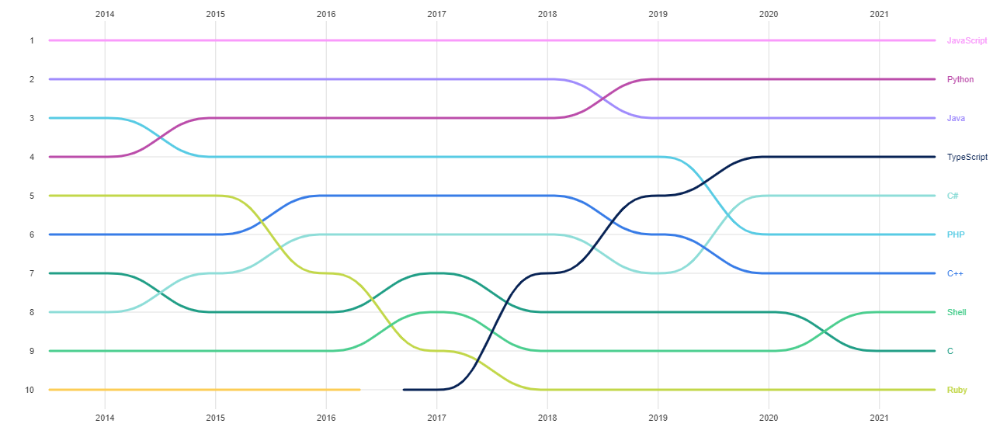

# TypeScript

## Introduction

[TypeScript](https://www.typescriptlang.org/) est un superset de JavaScript (donc du JavaScript mais avec des annotations de types). Le compilateur propose aussi des fonctionnalités qui permettent une compilation source à source plus stricte.

Dans l’écosystème Javascript, TypeScript devient de plus en plus populaire et est utilisé dans bon nombre de situations et ce même en JavaScript classique (par le biais de [JSDoc](https://www.typescriptlang.org/docs/handbook/jsdoc-supported-types.html) ou de fichier de définition). Si vous utilisez VSCode pour  écrire du JavaScript alors sans vous rendre compte TypeScript vous rend aussi service :)

[JavaScript #1 et TypeScript #4](https://octoverse.github.com/)

Il y a un bon nombre de débats sur Internet pour savoir quels sont les avantages et inconvénients de TypeScript. Comme toute chose dans la vie rien n’est tout blanc ou tout noir et il faut aussi savoir conserver les pieds sur terre. En ce qui me concerne, j'aime bien jongler entre des projets en JavaScript et des projets en TypeScript (tout dépend du contexte et du projet).

Néanmoins, je pense qu’il est important de dire qu’ici nous parlons de TypeScript strict (j’ai fait de nombreuses missions sur des codes avec des any partout…).

Il est vrai que, lorsqu’un code est proprement annoté avec des interfaces et types, il est souvent plus simple de maintenir le code (et certainement plus simple de lire et comprendre pour des développeurs avec moins d’expérience). Enfin cela reste évidemment un sentiment qui n’a certainement rien de concret (il faut aussi avoir confiance en ses collègues.. rien ne dit qu’ils ont annoté le code correctement ^^).

---

⬅️ [⚡ ECMAscript: TC39](../3-ecmascript/tc39.md) |
➡️ [TypeScript: 🙊 TypeScript est secondaire](./typescript-est-secondaire.md)
