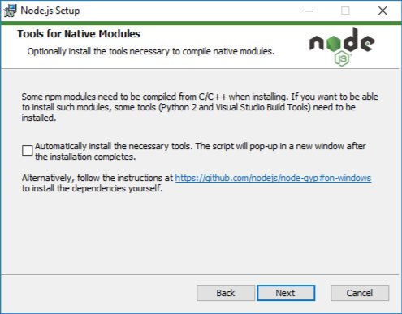

# 🐢 Node.js

## 👽 Native API (création d’addon natif en C, C++ et Rust)

Avec Node.js il est aussi possible de créer des [interfaces (addons) bas niveau](https://nodejs.org/api/n-api.html) pour par exemple exécuter des librairies écrites en C, C++.

Cela peut amener un avantage en matière de performance (mais ce n’est pas forcément tout le temps l’objectif.. passer de C++ à JavaScript a un coup non négligeable). Quelquefois c’est aussi tout simplement car les librairies C/C++ sont déjà très complètes et maintenues (ce serait potentiellement une perte de temps de tout ré implémenter en JavaScript).

Quelques exemples de packages NPM étant des addons natif :

- [node-argon2](https://github.com/ranisalt/node-argon2)
- [node-sqlite3](https://github.com/mapbox/node-sqlite3)
- [Windrive (fait par moi même pour récupérer des informations du Système)](https://github.com/SlimIO/Windrive)

D’ailleurs pour installer ces packages, il vous est bien souvent nécessaire d’installer diverses dépendances pour être en capacité de les compiler. Je vous invite à consulter la section [installation](https://github.com/nodejs/node-gyp#installation) de Node-gyp si vous n’étiez pas au courant de cela. (Il y a aussi une option à l’installation de Node.js sur Windows).

Si c’est un sujet qui vous intéresse j’ai [moi-même fait un talk en 2019](https://www.youtube.com/watch?v=rvmnnlYf3lk) pour vulgariser et expliquer mes premiers pas en création d’addons natif pour mon projet SlimIO.

Voici néanmoins une liste complémentaire de ressources :

- EN [Node-addon-api](https://github.com/nodejs/node-addon-api) (Pour ceux qui veulent écrire du code en C++).
- EN [Node-gyp](https://github.com/nodejs/node-gyp) (C’est l’outil qui va vous servir à compiler votre addon).
- EN [Node.js addons examples](https://github.com/JoseJPR/nodejs-addons)
- EN [Prebuildify](https://github.com/prebuild/prebuildify) (Pour la création de prebuilds)

Documentation et outil GYP :

- EN [GYP User Documentation](https://gyp.gsrc.io/docs/UserDocumentation.md)
- EN [GYP Input Format Reference](https://gyp.gsrc.io/docs/InputFormatReference.md)
- EN [GYP Parser](https://github.com/addaleax/gyp-parser)

Talks sur la native API de Node.js :

- EN [N-API - Next Generation Node API for Native Modules](https://www.youtube.com/watch?v=-Oniup60Afs)
- EN [N-API: The Next Generation Node.js API is Ready!](https://www.youtube.com/watch?v=BrJcsYjp8Nw&list=PLfMzBWSH11xaZvhv1X5Fq1H-oMdnAtG6k&index=54)
- EN [Next Generation N-API: A Hands-on Workshop](https://www.youtube.com/watch?v=-v4Q0y4CeRA&list=PLfMzBWSH11xZPfWcC0DqFqKo_reMP58mw&index=44)
- EN [N-API on JerryScript](https://www.youtube.com/watch?v=Pxabz_FA1IU&list=PLfMzBWSH11xaZvhv1X5Fq1H-oMdnAtG6k&index=69)

Bonus:

- EN [Introducing nsuv (NodeSource)](https://nodesource.com/blog/intro-nsuv)

### Rust

Divers liens pour faire des addons natif avec Rust plutôt que C et C++ :

- [Node.js N-API for Rust.](https://www.youtube.com/watch?v=UzTPBy2acio)
- [NAPI-RS](https://github.com/napi-rs)
- EN [Supercharge Your Node.js With Rust](https://www.yieldcode.blog/post/supercharge-nodejs-with-rust/)
- EN [Heavy computation in Node.js with Rust - Jean Burellier](https://www.youtube.com/watch?v=yme8ZZqa8NQ)

---

⬅️ [🐢 Node.js: 🎡 Event-loop](./5-event-loop.mdd) |
➡️ [🐢 Node.js: 📟 CLI](./7-cli.md)
