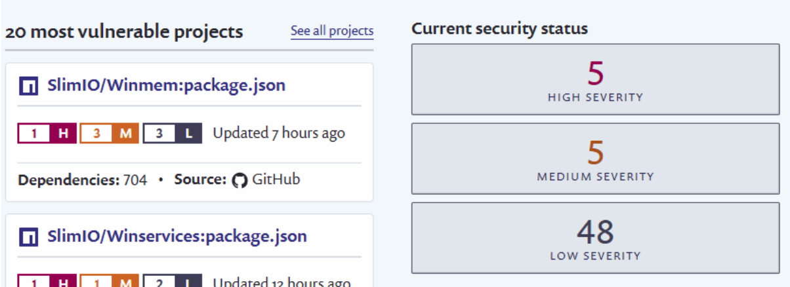
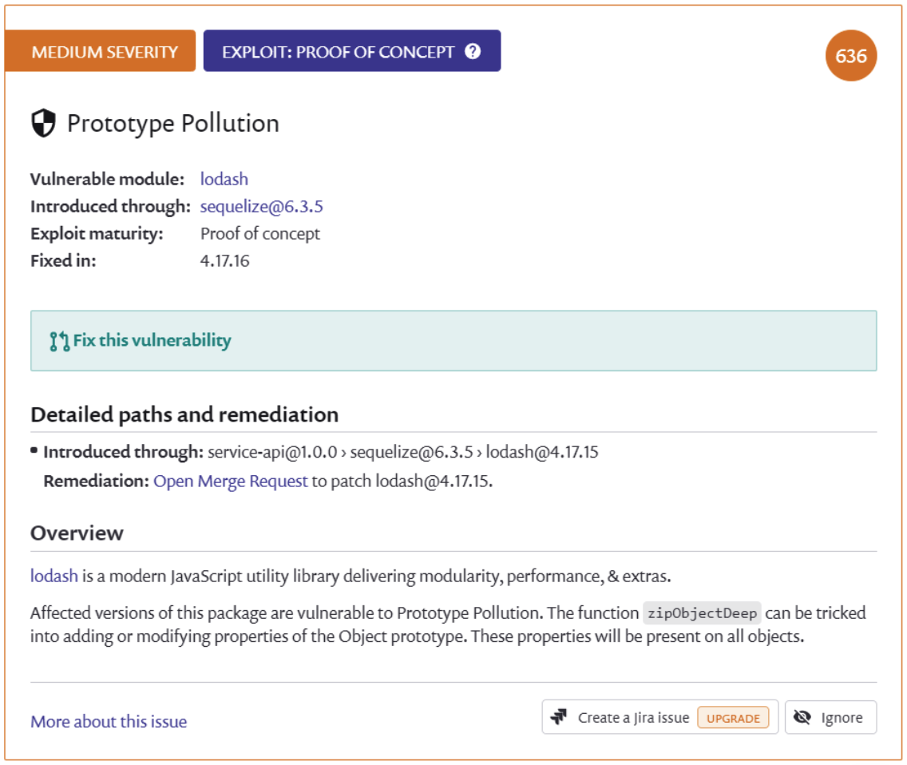

# 🔐 Sécurité

## Audit

Il devient obligatoire de mettre en place des audits de sécurité automatique sur vos dépendances afin d'avoir une vision même minimale des vulnérabilités "connues" au sein de chaque projet. Bien sûr, ce n'est que le premier pas vers une sécurité optimale!

Des outils tels que [Snyk](https://snyk.io/), [sqreen](https://www.sqreen.com/), [npm audit](https://docs.npmjs.com/auditing-package-dependencies-for-security-vulnerabilities) vous permettent d'avoir une vue d'ensemble des CVE actifs ou des attaques possibles sur vos projets (l’offre gratuite de snyk est d’ailleurs plutôt généreuse).

*Exemple ci-dessous d’un tableau bord snyk sur le projet SlimIO*

Les vulnérabilités détectées pendant la phase de **runtime** sont bien **évidemment prioritaires**(**puisqu’elles concernent les codes exécutés en production**).

> [!WARNING]
> Cela ne veut pas pour autant dire que les vulnérabilités détectées sur les dépendances de développement ne sont pas importantes !

Vous pouvez ouvrir l'un des projets pour avoir plus d'informations sur les différentes issues en cours. L'interface vous donnera tout un ensemble d'informations telles que des références et des explications sur le problème. Et, le cas échéant, des mesures correctives pour résoudre le problème.

À noter que Snyk à aussi développer un outil en ligne "[Snyk Advisory](https://snyk.io/advisor/)" qui vous permet à tout moment de vérifier les métriques en lien avec un package NPM.

---

⬅️ [🔐 Sécurité: Introduction](./1-introduction.md) |
➡️ [🔐 Sécurité: Garder sous contrôle votre Environnement](./3-garder-sous-controle-environnement.md)
