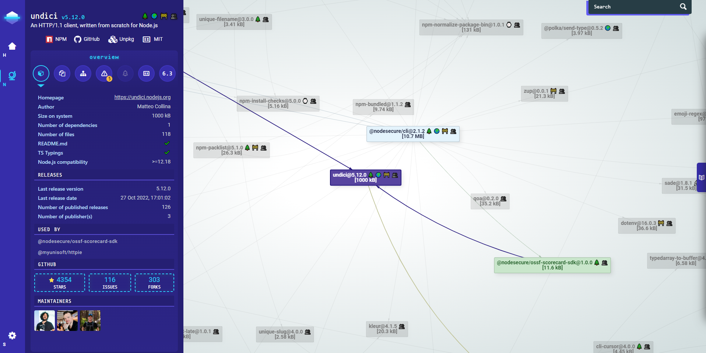

# 🔐 Sécurité

## Dépendances directes et indirectes

Les projets possédant des dépendances indirectes sont bien plus vulnérables comme [le montre cette récente étude](https://arxiv.org/pdf/1902.09217.pdf) ou [cet article](https://snyk.io/blog/78-of-vulnerabilities-are-found-in-indirect-dependencies-making-remediation-complex/) de snyk. Le grand problème est qu’il devient difficile de simplement corriger une faille de sécurité rapidement puisqu’elle n’est pas directement liée à la dépendance que vous utilisez.

Évitez à tout prix les packages avec des dépendances dépassant une profondeur de 2-3 packages (cela introduit toujours plusieurs dépendances indirectes à maintenir et sécuriser ce qui peut très vite devenir complexe).

Le projet [NodeSecure](https://github.com/NodeSecure/cli) permet d’analyser en profondeur les dépendances d’un projet ou d’un package npm.

> ⛔ Attention à ne pas non plus tomber dans la parano. Il n’est pas non plus, tout le temps simple, de résoudre des problématiques en quelques packages. L’important est d’être conscient du problème et de faire attention.

---

⬅️ [🔐 Sécurité: Garder sous contrôle votre Environnement](./3-garder-sous-controle-environnement.md) |
➡️ [🔐 Sécurité: Faille de sécurité courante](./5-faille-securite-courante.md)
