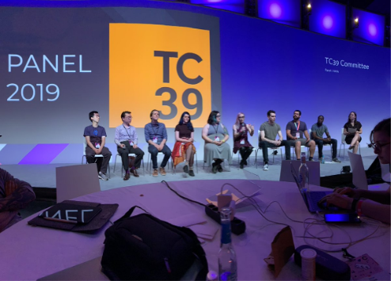

# ⚡ ECMAScript

## TC39

À un certain degré, il sera intéressant pour vous de vous pencher plus précisément sur le travail effectué par [TC39](https://tc39.es/) qui est le groupe responsable de la spécification du langage 💖. Pour mieux comprendre ce qu’est TC39 ainsi que le rôle des différents membres composant ce groupe je vous invite à écouter le [talk suivant](https://www.youtube.com/watch?v=slA06pbTRi4&list=PL37ZVnwpeshHwJPVBqEnZild7QHWhdufu&index=13) (ou bien celui de l’année [précédente](https://www.youtube.com/watch?v=Hj5q8uyqGYc&list=PL37ZVnwpeshG2YXJkun_lyNTtM-Qb3MKa&index=8))

Il est par exemple possible de suivre les prochaines fonctionnalités qui arriveront dans JavaScript grâce au repo git suivant: <https://github.com/tc39/proposals>. L’intégralité des propositions suit un processus bien défini qui est décrit [ici](https://tc39.es/process-document/).

En 2018 nous avions organisé FR [un Weektalk](https://www.youtube.com/watch?v=_onjCxViPu8) sur la communauté Discord francophone de JavaScript pour parler de quelques proposals. Si vous souhaitez apprendre à lire et comprendre la [spécification ECMAScript](https://www.ecma-international.org/publications/files/ECMA-ST/ECMA-262.pdf), je vous invite à consulter [les articles suivants](https://v8.dev/blog/tags/understanding-ecmascript) de l’équipe V8.

Autres liens:

- EN [Archives d’ECMAScript](https://www.ecma-international.org/ecmascript-development-archive/https://www.ecma-international.org/ecmascript-development-archive/)
- EN [ECMAScript forum](https://es.discourse.group/)
- EN [ES Discuss (Forum d'échange sur ECMAScript)](https://esdiscuss.org/)

---
[Page précédente](./javascript-20years.md)
[Page suivante](../typescript/introduction.md)
