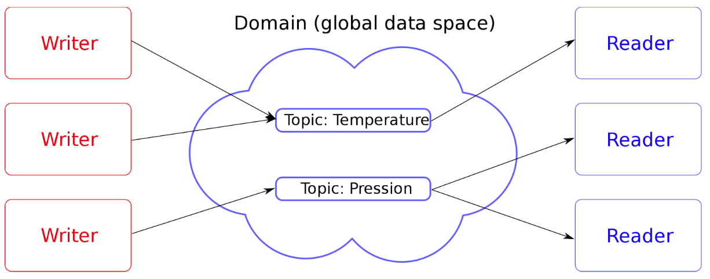

# 📡 MQTT (broker)

## Introduction 

MQTT (Message Queuing Telemetry Transport) est un protocole de messagerie [publish-subscribe](https://fr.wikipedia.org/wiki/Publish-subscribe) basé sur le protocole TCP/IP ([Wikipédia](https://fr.wikipedia.org/wiki/MQTT)).

MQTT est plutôt populaire pour la création de composants (logiciels) qu'on appellera des [brokers de messages](https://en.wikipedia.org/wiki/Message_broker) (comme une Queue ou plusieurs acteurs pourront écrire et consommer des messages). L’idée c’est bien souvent d’éviter un coupable trop fort entre différents composants d’une architecture.

À noter que nous parlons ici souvent du protocole MQTT mais il y a beaucoup de solutions qui sont bien plus bas niveau et qui préféreront conserver leurs propres implémentations en TCP/IP pour maximiser les performances.

---
[Page précédente](../databas/orm.md)
[Page suivante](./redis.md)