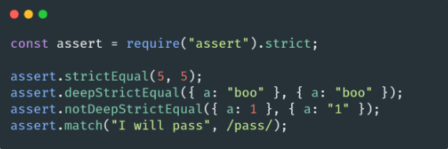

# 🐢 Node.js

## 🌟 Les différents modules core

### Assert

Un module assez simpliste contenant diverses fonctions d’assertion. Cela peut s’avérer utile si vous êtes du genre à faire des tests unitaires de manière assez simpliste (sans passer par de gros frameworks). Néanmoins cela peut très bien être utilisé pour des codes (c’est souvent utilisé dans des exercices ou des challenges par exemple).

---
[Page précédente](./vm.md)
[Page suivante](./zlib.md)