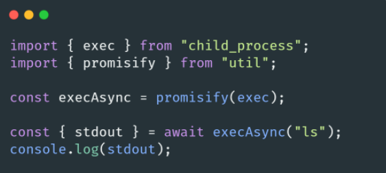

# 🐢 Node.js

## 🌟 Les différents modules core

### Child process

Le module child process va nous permettre de créer et gérer des nouveaux processus Node.js. Que ce soit pour simplement exécuter des commandes sur le système ou bien profiter d’avoir plusieurs CPU virtuels et exploiter les ressources de votre machine de manière plus optimale (pour par exemple gérer des tâches annexes). A ce titre les [Worker threads](https://nodejs.org/api/worker_threads.html) peuvent aussi servir.

Si vous êtes à la recherche d’un module simplifiant ces tâches, je vous recommande de jeter un œil à [execa](https://github.com/sindresorhus/execa#readme). (il y aussi [cross-spawn](https://github.com/moxystudio/node-cross-spawn)).

> ⛔ Attention à ne pas exécuter des commandes à partir de chaîne de caractères venant de l’extérieur sans effectuer de vérification stricte (un attaquant pourrait s’en servir pour exécuter du code sur votre système).

---
[Page précédente](./os.md)
[Page suivante](./utilities.md)