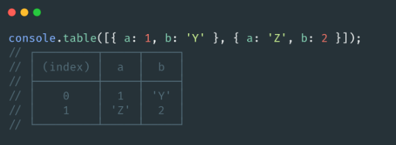
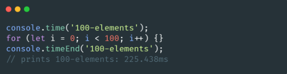

# 🐢 Node.js

## 🌟 Les différents modules core

### Console

Le module [console](https://nodejs.org/api/console.html) est celui que nous utilisons le plus (par le biais des méthodes console.log et console.error par exemple). Évidemment ici l’objectif est de simuler le plus possible le navigateur pour ne pas avoir à gérer les sorties stdout et stderr directement nous-mêmes par le biais de la variable process (ce qui peut être tout de même intéressant, je vous invite à aller voir la doc  [TTY](https://nodejs.org/api/tty.html) pour y découvrir des manipulations bien plus avancées de la sortie standard).

Bien souvent les développeurs n’utilisent pas ¼  des méthodes présentes dans le module et c’est plutôt dommage. Prenez le temps d’explorer la documentation pour découvrir les différentes méthodes et ce qu’elles vous permettent de faire.

Quelques exemples;

Connaître (approximativement) le temps d’exécution d’un code avec console.time.

[Page précédente](../test-unitaire-et-coverage.md)
[Page suivante](./events.md)