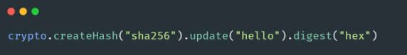
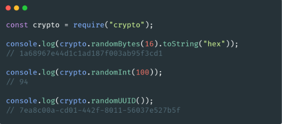

# 🐢 Node.js

## 🌟 Les différents modules core

### Crypto

Le module [Crypto](https://nodejs.org/api/crypto.html) (ou plus récemment [Web crypto](https://nodejs.org/api/webcrypto.html) qui est la version avec API compatible Web) est un module qui va vous permettre d’effectuer un ensemble d’opérations en lien avec le monde de la cryptographie.

Je ne suis pas spécialement très à l’aise avec tout cela mais en tant que développeur nous avons tout de même des besoins assez fréquents comme générer une chaîne SHA256 ou ce genre de choses (pour la signature d’un fichier par exemple).

Évidemment je ne vous recommande pas de gérer un chiffrage de mot de passe vous même car c’est très souvent le meilleur moyen de faire des bêtises (utilisez plutôt une lib comme [Argon2](https://github.com/ranisalt/node-argon2)). Si vous voulez savoir pourquoi je vous recommande d’aller lire l’article [suivant](https://medium.com/analytics-vidhya/password-hashing-pbkdf2-scrypt-bcrypt-and-argon2-e25aaf41598e).

En ce qui me concerne j’utilise aussi souvent le module crypto pour générer des valeurs aléatoires :

---
[Page précédente](./asynnc.md)
[Page suivante](../archive-packages-npm.md)