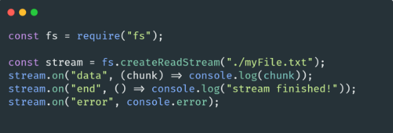
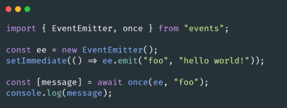
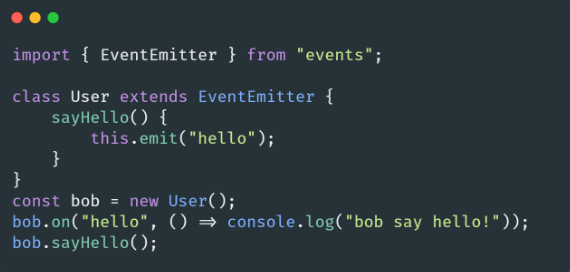
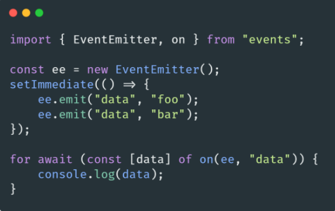

# 🐢 Node.js

## 🌟 Les différents modules core

### Events

Le module [Events](https://nodejs.org/api/events.html) va permettre de créer et manipuler un des éléments les plus importants de Node.js: l’Event Emitter (il y a aussi depuis peu Event Target qui est une API compatible avec le navigateur).

Les différents modules de Node.js comme HTTP, Net, Child process ainsi que les Streams sont majoritairement construits à l’aide d’Event Emitter. 

Exemple ci-dessus avec un Read Stream ou nous exploitons les évènements “data”, “end” ou encore “error” (**merci de pas reproduire ce code en production ^^**).

Ce sont des structures complètement **Synchrone** dans lesquelles nous pouvons lier un nom d’évènement (emitter) à une ou plusieurs functions (listeners). Les évènements qui seront émis sont gérés en FIFO (First in First out).

Cela va nous permettre de mettre en place diverses patterns ou le code fonctionnera  par le biais de communication entre différents objets.

Une class en JavaScript peut s'étendre d’un EventEmitter.

C’est pratique si vous voulez construire un système modulaire ou différent objets (class) communiquent par le biais de messages (les Addons dans SlimIO utilisent beaucoup ce principe).

Il est aussi bon de noter que depuis quelques versions la méthode “on” d'events est AsyncIterable. 

---
[Page précédente](./console.md)
[Page suivante](./path.md)