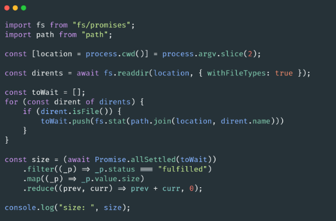

# 🐢 Node.js

## 🌟 Les différents modules core

### FileSystem (fs)

Comme son nom l’indique ce module permet d'interagir avec le système de fichiers. Si vous avez besoin de lire, modifiez un fichier, alors ce qu’il vous faut est très clairement dans ce module (et il en va de même pour les dossiers).

Bonus: [Article sur le module FS pour les débutants](https://catalins.tech/a-beginners-guide-to-the-file-system-module-in-nodejs).

Pour un junior ce module est une bonne opportunité pour s'entraîner sur la maîtrise de l’Asynchrone (Promise, Callback) sans nécessité de déployer de grand moyen (vous pouvez simuler des scénarios divers et variés sur votre OS).

Par exemple aller récupérer la taille d’un répertoire, les extensions de tous les fichiers dans le répertoire etc.. Et optimalement de manière asynchrone en évitant au possible de faire des séries (en utilisant des méthodes comme [Promise.all](https://developer.mozilla.org/fr/docs/Web/JavaScript/Reference/Objets_globaux/Promise/all) et [Promise.allSettled](https://developer.mozilla.org/fr/docs/Web/JavaScript/Reference/Objets_globaux/Promise/allSettled)).

Les opérations sur FS sont gérées en arrière fond par Libuv et distribuées sur [des Threads](http://docs.libuv.org/en/v1.x/threadpool.html). 

---
[Page précédente](./path.md)
[Page suivante](./timers.md)