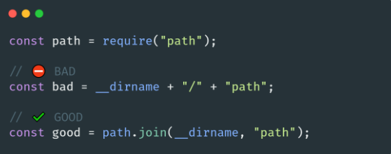
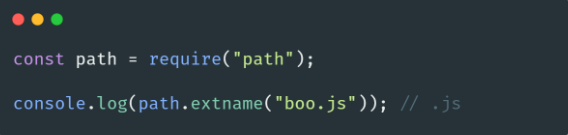

# 🐢 Node.js

## 🌟 Les différents modules core

### Path

Le module [path](https://nodejs.org/api/path.html) fournit des utilitaires pour travailler avec les chemins de fichiers et de répertoires.

Il sera la plupart du temps utilisé pour de la composition de chemin (si vous les faites à **la main vous-même c’est que votre code n’est probablement pas cross-plateforme**).

Les chemins ne sont pas construits de la même manière selon le système d’exploitation qui sera utilisé (UNIX, Windows, MAC etc). Si vous êtes intéressés par les bonnes pratiques d'écriture de code cross-plateforme, je vous recommande [Awesome Node.js cross platform](https://github.com/bcoe/awesome-cross-platform-nodejs).

Le module path possède aussi un ensemble de méthodes qui vont vous permettre de récupérer les différentes parties qui composent le chemin d’un fichier ou dossier. Comme par exemple l’extension d’un fichier (que tous les juniors s’amusent à récupérer avec une RegExp ou avec des bidouilles .split etc).

---
[Page précédente](./events.md)
[Page suivante](./fs.md)