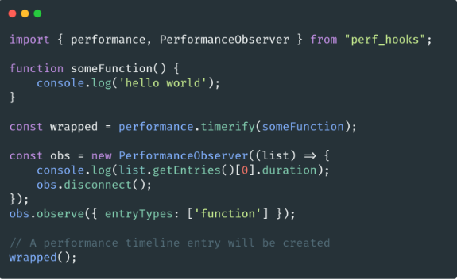

# 🐢 Node.js

## 🌟 Les différents modules core

### perf_hooks

Ce [module](https://nodejs.org/api/perf_hooks.html) fournit une implémentation d'un sous-ensemble [des API de performance Web du W3C](https://w3c.github.io/perf-timing-primer/) ainsi que des API supplémentaires pour les mesures de performance spécifiques à Node.js.

C’est un module vraiment cool qui va vous permettre de mesurer bien plus précisément les performances de méthodes JavaScript. Il est d’ailleurs fortement recommandé d’utiliser [performance.now()](https://nodejs.org/api/perf_hooks.html#perf_hooks_performance_now) plutôt que Date.now(). 

Dans SlimIO [nous utilisons](https://github.com/SlimIO/Addon/blob/5c5963c36fca462452f04b724e6050664fb27efc/src/callback.class.js) le module en combinaison avec des hooks Asynchrone pour nous permettre de générer des métriques sur les temps d'exécution de nos callbacks (ce qui nous permet de faire du self monitoring).

Le module perf_hooks vous permet aussi de faire du monitoring sur l’event-loop (voir la section monitoring en bas pour plus de ressources sur le sujet).

---
[Page précédente](./readline.md)
[Page suivante](./async_hooks.md)