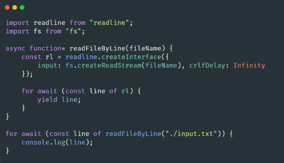
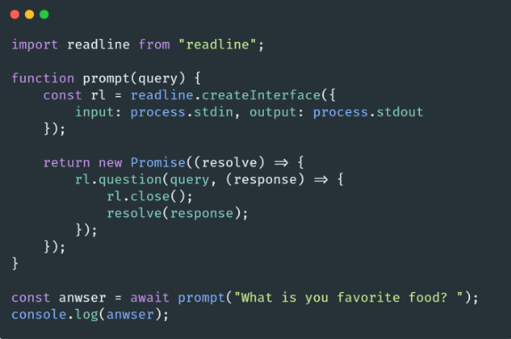

# 🐢 Node.js

## 🌟 Les différents modules core

### Readline

Le module readline va permettre de consommer des Streams du type “Readable” ligne par ligne. Par exemple si vous souhaitez lire un fichier ligne par ligne :

Parce que process.stdin est un Stream Readable il est aussi possible de créer des CLI (ou tout simplement des prompts).

---
[Page précédente](./zlib.md)
[Page suivante](./perf_hooks.md)