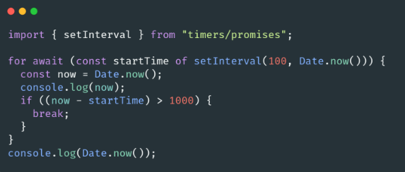

# 🐢 Node.js

## 🌟 Les différents modules core

### Timers

Le module [Timers](https://nodejs.org/api/timers.html) de Node.js contient des fonctions qui exécutent le code après une période de temps déterminée. Il n'est pas nécessaire d'importer les timers via require(), car toutes les méthodes sont disponibles globalement pour émuler l'API JavaScript du navigateur.

> Je vous recommande d’aller lire le guide officiel de Node.js sur les [timers](https://nodejs.org/en/docs/guides/timers-in-node/).

Les functions disponibles sont le setImmediate, setTimeout et setInterval.

**setImmediate** est une function unique à Node.js (elle n’existe pas dans le navigateur) et elle permet d’exécuter du code au début de la prochaine itération de l’event-loop.

Noter qu’il est possible d’appeler la méthode unref sur un timer pour que l’event-loop puisse s’arrêter même si le timer est encore actif. C’est très utile dans les cas où vous ne voulez absolument pas qu’un timer (interval par exemple) puisse empêcher l’event-loop de s’arrêter.

C’est par exemple le cas dans le package [SlimIO/Config](https://github.com/SlimIO/Config/blob/master/src/config.class.js#L272) ou un setInterval est utilisé pour constamment nettoyer des Observables qui ont été clôturés (pour éviter un memory-leak). Néanmoins je ne souhaite pas que le timer en question empêche l’arrêt de l’event-loop dans le cas où quelqu’un utiliserait mon package :) 

---
[Page précédente](./fs.md)
[Page suivante](./url.md)