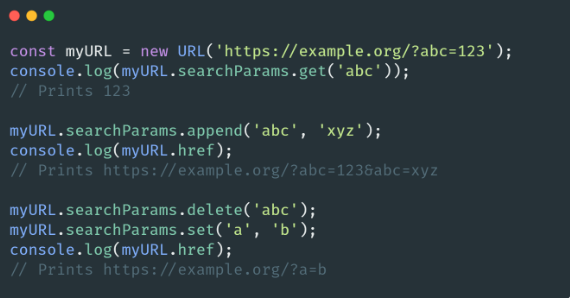

# 🐢 Node.js

## 🌟 Les différents modules core

### URL (API WHATWG)

Implémentation de l’API [URL](https://nodejs.org/api/url.html) du navigateur. Par défaut disponible sur le namespace Global comme pour les timers. URL est vraiment pratique pour la création et manipulation d’URL (comme pour path beaucoup de développeurs peu expérimentés vont construire des solutions maison alors que cet API leur permettrait de faire ce qu’ils souhaitent très simplement).

À mon goût cela devrait être beaucoup plus utilisé (même pour déclarer et identifier une URL dans un code JavaScript). L’évolution et la maintenance des codes n’en seront que bien plus simple. 

Le constructeur s’occupera de valider l’URL pour vous (une erreur sera throw s’il l’URL n’est pas valide). Vous pourrez ensuite récupérer toutes les informations que vous souhaitez sur votre URL (protocol, username, password, hostname, port, pathname, query etc).

URL peut être aussi utilisé en ESM avec import.meta.url pour remplacer __dirname.

<!-- TODO: 2e img -->

Bonus: [How to migrate from querystring to URLSearchParams in Node.js](https://www.linkedin.com/pulse/how-migrate-from-querystring-urlsearchparams-nodejs-vladim%25C3%25ADr-gorej/?trackingId=OEdtd%2BKZRxWNkgptsoWKlA%3D%3D)

---
[Page précédente](./timers.md)
[Page suivante](./os.md)