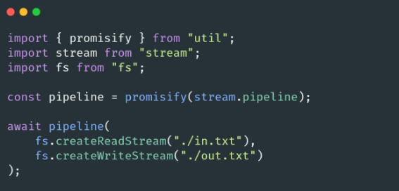
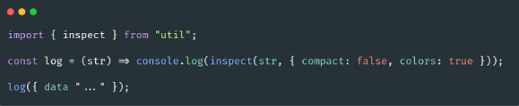

# 🐢 Node.js

## 🌟 Les différents modules core

### Utilities

Le module util contient différentes petites functions utilitaires. Nous l’utilisons le plus souvent pour récupérer promisify qui nous permettent de convertir un callback en Promise.

Il existe aussi une function pour passer d’une Promise à un callback ([callbackify](https://nodejs.org/api/util.html#util_util_callbackify_original)). Néanmoins je ne l'ai jamais utilisée^^..

La function [deprecate()](https://nodejs.org/api/util.html#util_util_deprecate_fn_msg_code) peut être utile si vous voulez par exemple rendre deprecated une méthode d’un package ou d’un projet. Cela permet d’avertir les développeurs à l’avance d’une prochaine mise à jour SemVer major qui supprimera la dit fonctionnalité.

La méthode [inspect()](https://nodejs.org/api/util.html#util_util_inspect_object_showhidden_depth_colors) peut-être utile si vous avez besoin de logs des objets d’une manière spécifique (avec différents niveaux de profondeur etc). C’est la méthode utilisée under the hood quand vous utilisez des méthodes console.

---
[Page précédente](./child_process.md)
[Page suivante](./vm.md)