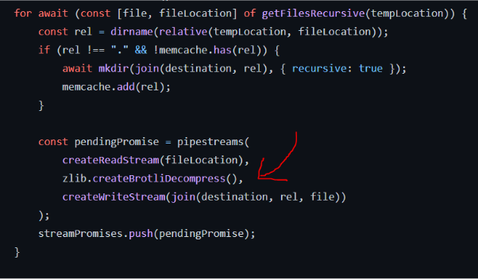

# 🐢 Node.js

## 🌟 Les différents modules core

### Zlib

Le module [zlib](https://nodejs.org/api/zlib.html) fournit des fonctionnalités de compression mises en œuvre à l'aide de Gzip, Deflate/Inflate et Brotli. Vous aurez à l’utiliser le plus souvent si vous manipulez des archives sur votre système.

Si vous avez à gérer des archives en .tar ou .zip je vous recommande les packages suivants :

- [tar-fs](https://github.com/mafintosh/tar-fs)
- [Unzipper](https://github.com/SlimIO/unzipper)

---
[Page précédente](./assert.md)
[Page suivante](./readline.md)