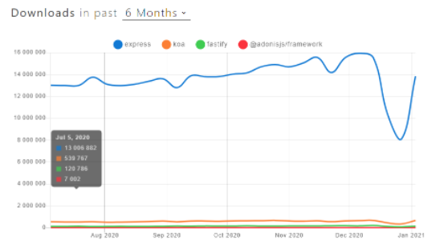

# 🐢 Node.js

## 🌐 Découverte de l’écosystème HTTP Node.js

### 🚣 Introduction

Il est assez fréquent que les nouveaux développeurs commencent avec [express](https://expressjs.com/fr/) car c’est le framework qui nous est directement vendu comme “le plus populaire” (et évidemment le plus présent dans les différents tutoriels accessibles en surface).

Néanmoins [ce n’est pas forcément le meilleur choix](https://dev.to/romainlanz/why-you-should-drop-expressjs-in-2021-711) car l’équipe derrière **express** maintient difficilement le framework! (**une V5 attendu depuis six ans 🙊**) De plus, beaucoup des patterns qu’ils recommandent sont complètement démodés (toujours pas de support async/await …). Vous allez écrire du code qui n'inclut rien des pratiques modernes.

**Comment choisir le bon framework alors ?** Eh bien il nous faut déjà essayer de segmenter ces frameworks par famille pour mieux comprendre et débattre des différents trade-offs que chaque solution implique.

Ces familles sont les suivantes;

- Small scope
- Big scope
- Full Stack scope

> La segmentation est inspirée d’une explication de Romain Lanz dans un talk Adonis.js! (qu’il a repris lui-même d’Evan You).

### 💡 Serveur HTTP natif avec Node.js et un peu de liens sur le protocole

Avant de rentrer dans le vif du sujet et de parler des différentes familles de “frameworks” dans l’écosystème Node.js, il me semble important de faire un petit chapitre pour vous parler du [module core http](https://nodejs.org/api/http.html).

Il peut être intéressant d’étudier et travailler [le fonctionnement d’un serveur HTTP Natif](https://www.digitalocean.com/community/tutorials/how-to-create-a-web-server-in-node-js-with-the-http-module). Cela ne vous sera pas forcément directement nécessaire pour du code de production, mais va vous permettre de comprendre, un peu mieux, comment interagir en HTTP sans avoir l’abstraction d’un framework qui s’occupera de gérer la difficulté et les détails relous pour vous (**Si vous n’avez pas déjà une expérience conséquente sur le sujet évidemment**).

C’est aussi intéressant pour vous permettre d’avoir une meilleure compréhension du [protocole HTTP](https://tools.ietf.org/html/rfc7231). Je vous recommande aussi de lire le book [High Performance Browser Networking](https://hpbn.co/).

Mon collègue youtuber [Tonygo_](https://www.youtube.com/channel/UC0yiy-XPDRVAgLaAiA8kvrQ) a par ailleurs produit quelques vidéos sympas dessus;

- FR **[Débutant]** [TOUT SUR LES MÉTHODES HTTP EN 12 MINUTES !](https://www.youtube.com/watch?v=B-3TGySiSLo)
- FR **[Débutant]** [CONNAÎTRE TOUS LES STATUS CODES HTTP PAR COEUR ?](https://www.youtube.com/watch?v=twKgr_ERZJI)

Autres talks Node.js autour de HTTP 1, 2 et 3 (QUIC).

- EN [Implementing HTTP/2 for Node.js Core](https://www.youtube.com/watch?v=7uNGKCao8gA)
- EN [A QUIC Update](https://www.youtube.com/watch?v=Fu9i2knjq8g)
- FR **[Débutant]** [Workshop API REST, RPC & ResourceFUL (talk que j'ai fait pour une mission)](https://www.dropbox.com/s/gdny6hc2calq0k5/Workshop%20API.mp4?dl=0)

Documentation sur l’écriture d’un serveur HTTP Node.js sans frameworks:

- EN [Node.js server without a framework (MDN)](https://developer.mozilla.org/en-US/docs/Learn/Server-side/Node_server_without_framework)

Je vous recommande aussi de garder à l'œil le projet [undici](https://github.com/nodejs/undici) qui devrait être le prochain client HTTP Node.js (plutôt que d’utiliser got ou axios).

### 🚁 Framework Small scope

Ces frameworks ou “micro-frameworks/libs” pour certains 😏 sont bien souvent de petite taille et imposent très peu d’opinions au développeur (le framework ne vous contraint pratiquement pas à suivre des pratiques, des patterns, un outil X plutôt que Y etc). Ils sont bien souvent de simples routeurs http avec une modularité fournie par le biais d’un simple système de middleware.

Il est souvent de la responsabilité du développeur pour chaque API d’assembler/coller un ensemble de packages npm et middlewares entre eux pour aboutir au résultat attendu.

C’est une façon de faire qui donne “souvent” beaucoup de flexibilité et une certaine sensation de liberté (ce qui peut être perçu positivement ou négativement selon les besoins et les mentalités de chacun). C’est certainement aussi une façon de faire qui correspond à beaucoup de développeurs qui n’aiment pas particulièrement suivre des modèles prédéfinis.

Liste non exhaustive de ces frameworks

- [express](http://expressjs.com/)
- [koa.js 2](https://koajs.com/) (petit frère d’express, encore vivant mais je ne recommande pas l’utilisation de ce framework pour 2021+).
- [hapi](https://hapi.dev/) (j’aurais recommandé il y a encore peu... mais je pense que les dernières annonces ont sacrément impacté la maintenance des différents packages).
- [polka](https://github.com/lukeed/polka#readme)
- [fastify.js](https://www.fastify.io/)
- [micro](https://github.com/vercel/micro)

À ce jour, le framework le mieux maintenu est Fastify (qui est supporté par la fondation [OpenJS](https://openjsf.org/)). J’utilise aussi beaucoup la version @next de polka pour construire des micro API très light (notamment pour de l’http embarqué et des CLI).

Cela inclut aussi les frameworks spécialisés dans la création de micro-service comme [Moleculer](https://moleculer.services/). Néanmoins il est moins fréquent de les rencontrer en entreprise (moi-même je n'ai pas réellement d’expérience avec un de ces frameworks).

### ✈️ Framework Big scope

Ces frameworks vous imposent bien souvent dès le début un ensemble d’opinions et vous fournissent un ensemble de packages et modules pré-intégrés pour gérer divers besoins (Template engine, Form Validator, ORM, Auth, Queue, Sécurité etc).

L’objectif est de vous apporter **très rapidement une plus-value business et une meilleure expérience développeu**r sans que vous ayez à reconstruire la roue pour chaque fonctionnalité qui ne serait pas liée au besoin métier de votre application.

La courbe d’apprentissage de ces frameworks peut être légèrement plus longue car ils demandent souvent d’acquérir tout un ensemble de notions supplémentaires qui sont elles même souvent en lien avec les opinions du framework (Structure d’un projet, MVC etc...) ainsi que prendre en main les éléments et code souvent propre à chaque framework (**Ce qui n’est pas forcément un point négatif sachant que bien souvent les développeurs s’amusent à recréer cela eux mêmes sur express**).

Néanmoins vous y gagnerez certainement en productivité sur le long terme (surtout si vous êtes amenés à souvent construire de nouveaux projets avec des besoins métier assez importants).

Comme pour le Small-scope ce sont des frameworks purement back-end. La liste des frameworks “sérieux” est néanmoins assez courte car il est vraiment très difficile de construire et maintenir de tels projets sur le long terme:

- [Adonis.js](https://adonisjs.com/)(Je vous recommande aussi de lire la page Why Adonis.js ?)
- [Nest.js](https://nestjs.com/)

⚠️ **Attention** car de nos jours beaucoup de vieux frameworks qui ne sont plus réellement maintenus sont toujours activement recommandés :

- [Sails.js](https://sailsjs.com/) (même chose pour le fork Trails.js). Je vous recommande de lire [Don’t Use Sails (or Waterline)](https://kevin.burke.dev/kevin/dont-use-sails-or-waterline/).
- [Loopback 3](https://loopback.io/) (je ne recommande pas non plus la version 4).

> J’ai eu l’occasion de travailler professionnellement avec ces deux frameworks et je vous recommande très fortement de les fuir pour tout nouveau projet.
>
> Il n’est pas rare qu’aujourd’hui des développeurs maintiennent encore des projets sur ces frameworks 😨

### 🌠 Framework Full-stack

Je ne suis pas un grand spécialiste sur les frameworks fullstack (je n’ai d’ailleurs encore aucune expérience avec ces frameworks car je fais que très peu de front-end ces dernières années).

Néanmoins je peux vous dire que les frameworks fullstack sont** “souvent”** des frameworks qui vont essayer de réunir front-end et back-end pour construire le tout au sein d’une abstraction unifiée. Leur objectif est de simplifier le cycle de développement (et l’expérience du développeur A.K.A **DX**) par le biais d'abstractions qui vont cacher divers détails techniques (enfin c’est l’idée.. après dans la réalité cela peut être source de débats).

Il existe néanmoins une assez grande diversité de choix et de façon de faire les choses, alors il est assez difficile de mettre des mots précis sur ces choses-là. Le plus important pour moi est de comprendre qu’il y a toujours la composante front et back qui vont s'entremêler.

Liste des frameworks (uniquement ceux que je connais):

- [Next.js](https://nextjs.org/) (Utilise React.js pour le front, ne pas confondre avec Nest.js)
- [Nuxt.js](https://fr.nuxtjs.org/) (Utilise Vue.js pour le front, voir [le weektalk #8](https://www.youtube.com/watch?v=wte-XtcaTCo) par Romain Lanz).
- [Sapper](https://sapper.svelte.dev/) (Utilise Svelte.js pour le front).
- [Gatsby](https://www.gatsbyjs.com/)

> ⛔ Je vous recommande fortement d’éviter le framework Meteor (même délire que le chapitre précédent).

### 🎯 Comment faire un choix

Si vous êtes un développeur plutôt front-end avec un petit intérêt pour le back-end, alors il est fort probable que les frameworks fullstack soient plus intéressants pour vous (Next, Nuxt ou Sapper).

Si vous souhaitez plutôt vous spécialiser en back-end alors je vous recommande de vous intéresser aux deux familles (small & big scope). En ce qui me concerne je vous recommande [Fastify](https://www.fastify.io/) et [Adonis](https://adonisjs.com/) / [Nest.js](https://nestjs.com/).

- EN [Intro to Fastify - Matteo Collina](https://www.youtube.com/watch?v=FQu8FnTzOR0&feature=emb_logo) (podcast [bonus ici](https://webrush.io/episodes/episode-96-expressway-to-fastify-with-matteo-collina)).
- EN [Adonis 5 Tour - Romain Lanz](https://www.youtube.com/watch?v=TysfaNcFX_Y&feature=emb_logo)
- FR [**débutant**] [LMHB #3: MONTER UNE APP WEB RAPIDEMENT AVEC ADONIS.JS FEAT @ROMAINLANZ](https://www.youtube.com/watch?v=vcrjgZezaI0&feature=youtu.be)

> 👀 Un récent article de Snyk parle d’ailleurs EN [du succès de Fastify](https://snyk.io/advisor/hub/what-makes-fastify-a-successful-project/).

Si vous êtes plutôt un puriste ou un développeur bas niveau et que vous aimez bien tout maîtriser de A à Z, alors il est fort probable que la famille small-scope soit pour vous. Il peut être intéressant pour vous dès lors d’explorer les différentes solutions (même si elles ne sont pas forcément mainstream).

> 📌 Notons tout de même que Adonis possède aussi une version light qui n’embarque que le strict minimum ce qui peut être aussi une piste viable à visiter.

Il existe un framework du nom de [Kuzzle](https://kuzzle.io/) que je ne savais pas trop comment classer (il représente certainement à lui seul une famille ^^). Je souhaitais tout de même en parler très rapidement sachant que le framework à un support non négligeable en France.

---
[Page précédente](./ressources-debutant.md)
[Page suivante](./conferences-et-articles.md)