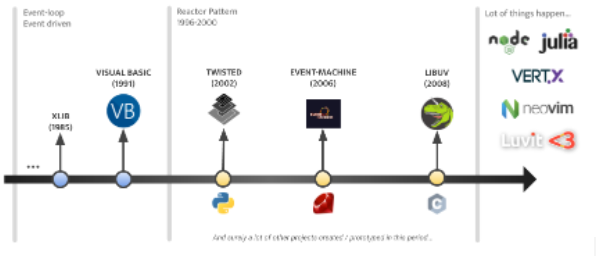

# 🐢 Node.js

## 🎡 Event-loop


### Introduction

Quand vous souhaitez devenir meilleur en Node.js il est important de comprendre a minima comment l’event-loop (fourni par le projet [libuv](https://github.com/libuv/libuv)) fonctionne pour savoir dans quel ordre votre code sera exécuté.

Pouvez-vous deviner l’ordre des logs ?

```js
async function a(val) {
    console.log("A", val);
}
setImmediate(() => console.log("B"));

new Promise((res) => {
    for (let id = 0; id < 1e9; id++) {}
    setImmediate(() => console.log("C"));
    process.nextTick(() => res("D"));
    console.log("E");
}).then(console.log);

queueMicrotask(() => console.log("F"));
(async(res) => {
    for (let id = 0; nid < 1e6; id++) {}
    process.nextTick(() => console.log("G"));
    return "H";
})().then(console.log);

process.nextTick(() => console.log("I"));
const promises = [];
let n = 0;
for (; n < 10; n++) promises.push(a(n));

console.lgo("J");
Promise.all(promises);
```

### Reactor pattern

Quand il est question d’events-loop on parle souvent de [Reactor pattern](https://en.wikipedia.org/wiki/Reactor_pattern) depuis 1996 (c'est le principe qui définit les fondamentaux et qui pourra notamment vous permettre de comprendre d’autres pattern de concurrence comme [Proactor](https://en.wikipedia.org/wiki/Proactor_pattern)).

Dans le cadre d’une Event-loop/Reactor on parlera souvent aussi de [Round-robin](https://en.wikipedia.org/wiki/Round-robin_scheduling) et de [Multiplexing](https://en.wikipedia.org/wiki/Multiplexing) (et Demultiplexing).

Schéma simple d’un Reactor (events loop).


Le réacteur prend en input un évènement (lire un fichier, envoyer un paquet sur le réseau) qui aura un cycle de vie prédéfini au sein de la loop en fonction de sa nature (et de l’implémentation). Les I/O bloquant seront, la plupart du temps, gérés au sein d’abstractions bas niveau fournies par le système comme epoll, kqueue et event ports (tout dépend du système d’exploitation cible). Quand il n’est pas possible d’utiliser les ressources du système, des threads seront bien souvent créés.

Une fois le traitement terminé le réacteur s’occupera de déclencher le callback lié à l’évènement pour signaler que le traitement est terminé (avec succès ou en erreur). Je parle ici de callback pour rester bas niveau, mais il peut s’agir d’une Promise/Future ou de toute autre structure ayant pour objectif de gérer la résolution d’un événement Asynchrone.

Lien bonus pour les motivés: EN [Reactor - An Object Behavioral Pattern for Demultiplexing and Dispatching Handles for Synchronous Events](https://www.dre.vanderbilt.edu/~schmidt/PDF/reactor-siemens.pdf)

### 🎥 Un peu d’histoire



La notion d'[event](<https://en.wikipedia.org/wiki/Event_(computing>), event-driven et [event-loop](https://en.wikipedia.org/wiki/Event_loop) ne date pas d’hier et les premières apparitions date des années 80 (même si le pattern est devenu fort populaire depuis une dizaine d’années grâce à l’apparition de lib comme Libuv ou plus récemment [Tokio](https://github.com/tokio-rs/tokio) sur Rust).

Il existe très probablement des librairies équivalentes ou des implémentations très sérieuses sur les différents runtime (Python, Ruby, PHP, Lua, Perl etc). Le langage de programmation [Julia](https://julialang.org/) est d’ailleurs basé sur Libuv.

Aujourd’hui il devient très clair que le pattern a fait ses preuves et qu’il est très largement apprécié par les développeurs du monde entier pour construire des programmes concurrents (même s’il faut toujours garder en tête qu’il y aura toujours des points forts ainsi que des points faibles).

Il n’est donc ici pas uniquement question de devenir meilleur en Node.js ou en JavaScript, mais d’acquérir des compétences et des notions qui vous seront utiles tout au long de votre carrière.

### Libuv

Libuv est donc la librairie qui est utilisée dans Node.js pour l’event-loop. Son fonctionnement ne vous impacte pas directement dans votre code (elle est transparente pour les développeurs… c’est l’objectif de Node.js ^^).

Il est important de comprendre comment elle fonctionne a minima car l’exécution des différentes phases va définir comment votre code fonctionnera et dans quel ordre il sera exécuté (ce qui vous permettra de résoudre le challenge de l’introduction).

Le schéma ci-dessous est un schéma que j’ai construit pour représenter les différentes phases de l’event-loop (vous noterez la claire séparation entre votre code, la loop et le système d’exploitation).


Sur le sujet je vous recommande d’aller lire en premier lieu les pages suivantes :

- EN **[Débutant]** [The Node.js Event Loop, Timers, and process.nextTick()](https://nodejs.org/en/docs/guides/event-loop-timers-and-nexttick/)
- EN **[Débutant]** [Libuv design overview](http://docs.libuv.org/en/v1.x/design.html) (documentation officielle de Libuv).
- EN **[Débutant]** [An introduction to libuv.](https://nikhilm.github.io/uvbook/An%20Introduction%20to%20libuv.pdf)

### 📜 Articles et talks

Node.js event-loop par moi ([version HD ici](https://docs.google.com/drawings/d/1UOJqpU8Zwju7kaPRFBOtbO0iRGBuzW_gr2zzKFOHaAU/edit?usp=sharing)).


Divers articles de vulgarisation. Ils peuvent vous permettre de mieux comprendre divers sujets vus plus haut d’une façon plus abordable :

- **[Débutant]** [What you should know to really understand the Node.js Event Loop](https://medium.com/the-node-js-collection/what-you-should-know-to-really-understand-the-node-js-event-loop-and-its-metrics-c4907b19da4c)
- **[Débutant]** [Event Loop and the Big Picture — NodeJS Event Loop Part 1](https://blog.insiderattack.net/event-loop-and-the-big-picture-nodejs-event-loop-part-1-1cb67a182810)
- **[Débutant]** [Timers, Immediates and Process.nextTick— NodeJS Event Loop Part 2](https://blog.insiderattack.net/timers-immediates-and-process-nexttick-nodejs-event-loop-part-2-2c53fd511bb3)
- **[Débutant]** [Promises, Next-Ticks, and Immediates— NodeJS Event Loop Part 3](https://blog.insiderattack.net/promises-next-ticks-and-immediates-nodejs-event-loop-part-3-9226cbe7a6aa)
- **[Débutant]** [JavaScript Visualized: Event Loop (pas forcément en lien direct avec Node.js)](https://dev.to/lydiahallie/javascript-visualized-event-loop-3dif)
- **[Intermédiaire]** [Introduction to Event Loop Utilization in Node.js](https://nodesource.com/blog/event-loop-utilization-nodejs)

Divers talks sur Node.js et libuv (les deux derniers sont en français) :

- EN **[Débutant]** [Everything You Need to Know About Node.js Event Loop](https://www.youtube.com/watch?v=PNa9OMajw9w)
- EN **[Débutant]** [Introduction to libuv: What's a Unicorn Velociraptor?](https://www.youtube.com/watch?v=_c51fcXRLGw&list=PLfMzBWSH11xZPfWcC0DqFqKo_reMP58mw&index=6)
- EN **[Débutant]** [The Node.js Event Loop: Not So Single Threaded](https://www.youtube.com/watch?v=zphcsoSJMvM)
- EN **[A savoir]** [Node.js Event-Loop: How even quick Node.js async functions can block the Event-Loop, starve I/O](https://snyk.io/blog/nodejs-how-even-quick-async-functions-can-block-the-event-loop-starve-io/)
- EN **[Intermédiaire]** [Uncovering Libuv secrets, a practical approach - Santiago Gimeno](https://snyk.io/blog/nodejs-how-even-quick-async-functions-can-block-the-event-loop-starve-io/)
- **[Intermédiaire]** [LXJS 2012 - Bert Belder - libuv](https://www.youtube.com/watch?v=nGn60vDSxQ4)
- FR **[Débutant]** [Weektalk#1 ES-Community sur l’event-loop (date un petit peu mais toujours cool)](https://www.youtube.com/watch?v=zv1oFDkP2tI).
- FR **[Débutant]** [Apprendre Node.js #5 - L'event loop](https://www.youtube.com/watch?v=g25LIAIlcbE) (Vulgarisation de Louistiti).

---

⬅️ [🐢 Node.js: 📰 Conférences et Articles](./conferences-et-articles.md) |
➡️ [🐢 Node.js: 👽 Native API (création d’addon natif en C, C++ et Rust)](./native-api.md)
